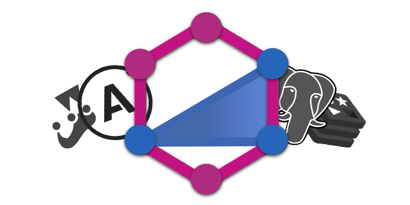
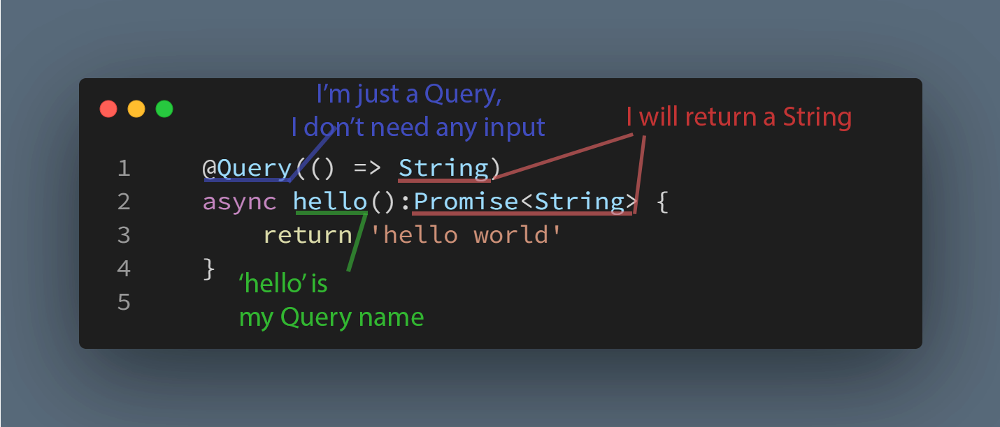
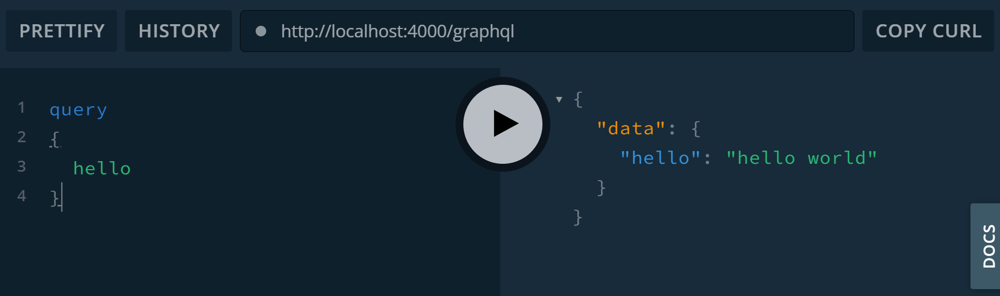
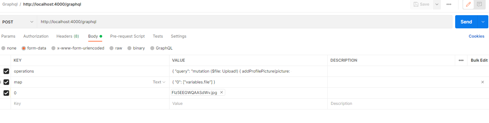

<p align="center"></p>
<h1 align="center">TypeGraphQL API Example</h1>


### Techs that has been used:

**GraphQL:** TypeGraphQL, Apollo

**Databases:** Redis,Postgres

**Testing Library:** Jest

## PARTS:
* Setup
    * [Basic Setup](#basic-setup)
    * [Next Level Setup (For all features)](#next-level-setup)
* [Resolver Basics](#resolver-basics)
* [Sending Query With GraphQL](#query-example-get-in-rest-api)
* [Entities](#entities)
* [Object Type](#what-is-objecttype)
* [Field Complexity](#what-is-field-complexity)
* [Validation](#validations)
* [Input Type](#input-type)
* [Custom Validator](#custom-validator)
* [Resolvers](#resolvers)
* [Register Resolver](#register-resolver)
* [Login resolver](#login-resolver)
* [Authorization](#authorization)
* [Logout](#logout)
* [Sending Email](#sending-email)
* [Confirmation Mail](#confirmation-mail)
* [Forgot Password Mail](#forgot-password-mail)
* [File Upload](#file-upload)
* [Relations (OneToMany)](#relations)
* [Set Relations In Resolvers](#relations-in-resolvers)
* [Dependency Injection](#dependency-injection)
* [Entity Resolver](#entity-resolver)
* [Testing Resolvers](#testing-resolvers)

## BASIC SETUP
**First of all if you don't have an up and running postgres and redis server you should install it .**

You can install `Redis` from [here](https://github.com/MicrosoftArchive/redis/releases/download/win-3.2.100/Redis-x64-3.2.100.msi) and `Postgres` from [here](https://www.enterprisedb.com/downloads/postgres-postgresql-downloads).<br>
After the install postgres, we have to create **postgres db** on **pgAdmin4** called `type-graphql-learning` and `type-graphql-learning-test` (like in *`ormconfig.js`* file)

After the installation we are ready to install npm packages.

We need to install some packages first:
```bash
npm i --save type-graphql typeorm typescript express pg ts-node-dev reflect-metadata
```
As well as some of their types:
```bash
npm i --save-dev @types/express @types/graphql
```
***
#### TSCONFIG:
We need to set tsconfig file. Here is the template:
```json
{
    "compilerOptions": {
      "target": "es6",
      "module": "commonjs",
      "lib": ["dom", "es6", "es2017", "esnext.asynciterable"],
      "sourceMap": true,
      "outDir": "./dist",
      "moduleResolution": "node",
      "declaration": false,
      "composite": false,
      "removeComments": true,
      "noImplicitAny": true,
      "strictNullChecks": true,
      "strictFunctionTypes": true,
      "noImplicitThis": true,
      "noUnusedLocals": true,
      "noUnusedParameters": true,
      "noImplicitReturns": true,
      "noFallthroughCasesInSwitch": true,
      "allowSyntheticDefaultImports": true,
      "emitDecoratorMetadata": true,
      "esModuleInterop": true,
      "experimentalDecorators": true,
      "skipLibCheck": true,
      "baseUrl": ".",
      "rootDir": "src"
    },
    "exclude": ["node_modules"],
    "include": ["./src/**/*.tsx", "./src/**/*.ts"]
}
```
Not important things. Just some fix settings of typescript.

***
#### ORMCONFIG:
We need to create `ormconfig.js` file for typeorm.

```ts
module.exports={
    "name":"default",
    "type": "postgres",
    "host": "localhost",
    "port": 5432,
    "username": "postgres",
    "password": "postgres",
    "database": "type-graphql-learning",
    "synchronize":true,
    "logging":true,
    "entities": [
        __dirname+"/src/entity/*.*"
    ]
 }
```
I think that everything is clear with settings.
<br>Now typeorm can make the connection.

Only thing the I think that I have to explain is the  `synchronize` feature.<br>
It means typeorm makes all the migrations for us.
Keeps database and entity model synchron.
<br>It is cool feature for the development but it should be closed in the production.

***
#### CREATING INDEX.TS FILE:

* src
    * index.ts

```ts
import 'reflect-metadata'
import {ApolloServer} from "apollo-server-express"
import Express from "express"
import { buildSchema} from "type-graphql";
import { ApolloServerPluginLandingPageGraphQLPlayground } from "apollo-server-core";
import { GraphQLError } from 'graphql';

const main = async()=>{

  const schema = await buildSchema({
      resolvers: [__dirname + '/modules/*/*.ts'],
  }) 

  const apolloServer = new ApolloServer({
    schema:schema,
    plugins:[ApolloServerPluginLandingPageGraphQLPlayground],
  })

  const app = Express()

  await apolloServer.start()

  apolloServer.applyMiddleware({app});

  app.listen(4000,()=>{
      console.log('server started on http://localhost:4000')
  })
}

main()
```
 The `resolvers` will check every .ts file in modules ro find **Resolvers**.

 It is the basic up and running server.
 <br> We still need to add some modifications in the feature. But it will be enaught for now.

 Let's add start command to `package.json` to actually run it.
 ```json
 "scripts":[
    "start": "ts-node-dev --respawn src/index.ts"
]
 ```
 Now `npm start` will work.
<br>
<br>
 

## NEXT LEVEL SETUP
**This setup includes everything we needed for now and future.**
<br><br>
**First of all;** if you don't have a up and running **postgres** and **redis** server you should install it .

You can install `Redis` from [here](https://github.com/MicrosoftArchive/redis/releases/download/win-3.2.100/Redis-x64-3.2.100.msi) and `Postgres` from [here](https://www.enterprisedb.com/downloads/postgres-postgresql-downloads).

After the installation we are ready to install npm packages.

We can install all of packages that we need with this command:
```bash
npm i --save type-graphql typeorm typescript express ts-node-dev cors bcryptjs class-validator connect-redis dotenv express-session fs graphql-query-complexity graphql-upload ioredis nodemailer nodemon pg redis reflect-metadata type-graphql-dataloader typedi typeorm-typedi-extensions uuid
```
As well as some of their types:
```bash
npm i --save-dev jest ts-jest @types/uuid @types/nodemailer @types/express @types/graphql @types/jest @types/graphql-upload @types/faker @types/bcryptjs @faker-js/faker @types/connect-redis @types/cors @types/express-session @types/node
```
***
[tsconfig](#tsconfig) and [ormconfig](#ormconfig) explained before.
***
#### CREATING INDEX.TS FILE:

* **src**
    * *index.ts*
    * *redis.ts*
    * **types**
        * *MyContext.ts*
        * *Upload.ts*
    * **test**
        * *setup.ts*
        * **modules**
            * *gCall.ts*
            * *testConn.ts*


**index.ts** (explained one by one)<br>
*it will look like this when it's done.*
```ts
import 'reflect-metadata'
import {ApolloServer} from "apollo-server-express"
import Express from "express"
import { buildSchema} from "type-graphql";
import { createConnection, useContainer } from 'typeorm';
import connectRedis from 'connect-redis';
import { redis } from './redis';
import cors from 'cors';
import { ApolloServerPluginLandingPageGraphQLPlayground } from "apollo-server-core";
import session from 'express-session';
import { graphqlUploadExpress } from 'graphql-upload';
import createComplexityRule, { simpleEstimator,fieldExtensionsEstimator } from 'graphql-query-complexity';
import { GraphQLError } from 'graphql';

import {Container} from 'typeorm-typedi-extensions';


declare module 'express-session' {
  export interface SessionData {
      userId: any;
  }
}

const RedisStore = connectRedis(session)

const ruleComplexity = createComplexityRule({
  maximumComplexity: 500,

  variables: {},

  onComplete: (complexity: number) => {console.log('Determined query complexity: ', complexity)},

  createError: (max: number, actual: number) => {
    return new GraphQLError(`Query is too complex: ${actual}. Maximum allowed complexity: ${max}`);
  },

  estimators: [
    fieldExtensionsEstimator(),

    simpleEstimator({
      defaultComplexity: 1
    })
  ]
});


const main = async()=>{
  await createConnection()

  useContainer(Container)
  const schema = await buildSchema({
      resolvers: [__dirname + '/modules/*/*.ts'],
      container:Container,
      authChecker: ({ context :{req}}) => { //you can add @Authorized() to query or mutation
        // if(req.session.userId){
        //   return true
        // }
        // return false;
        return !!req.session.userId
      }
      
  }) 

  const apolloServer = new ApolloServer({
    schema,
    context: ({req,res}:any)=> ({req,res}),
    plugins: [ApolloServerPluginLandingPageGraphQLPlayground,],
    validationRules:[
      ruleComplexity
    ]
  })

  const app = Express()
  app.use(cors({credentials:true,origin:"http://localhost:4000"}))

  const sessionOption: session.SessionOptions = {
    store: new RedisStore({
      client: redis as any,
    }),
    name: "qid",
    secret: process.env.SESSION_SECRET || "asfşlkasşlfaosf3",
    resave: false,
    saveUninitialized: false,
    cookie: {
      httpOnly: true,
      sameSite: "lax",
      secure: process.env.NODE_ENV === "production",
      maxAge: 1000 * 60 * 60 * 24 * 7 * 365, // 7 years
    },
  };
  app.use(session(sessionOption));

  app.use(graphqlUploadExpress());

  await apolloServer.start()

  apolloServer.applyMiddleware({app});

  app.listen(4000,()=>{
      console.log('server started on http://localhost:4000')
  })
}

main()
```
First:
```ts
declare module 'express-session' {
  export interface SessionData {
      userId: any;
  }
}
``` 
helps to reach `userId` in **session** (fixes session error).
<br>
<br>

**main()**
<br>let's look inside main function

```ts
import { createConnection} from 'typeorm';
//imported before
await createConnection()
```
we need to wait typeorm for database connection

```ts
import {ApolloServer} from "apollo-server-express"
import { buildSchema} from "type-graphql"
import { useContainer } from 'typeorm';
import {Container} from 'typeorm-typedi-extensions';
import { ApolloServerPluginLandingPageGraphQLPlayground } from "apollo-server-core";

//imported before

//in the main() function:
  useContainer(Container)
  const schema = await buildSchema({
      resolvers: [__dirname + '/modules/*/*.ts'],
      container:Container,
      authChecker: ({ context :{req}}) => {
        return !!req.session.userId
      }
      
  }) 

  const apolloServer = new ApolloServer({
    schema,
    context: ({req,res}:any)=> ({req,res}),
    plugins: [ApolloServerPluginLandingPageGraphQLPlayground,],
    validationRules:[
      ruleComplexity
    ]
  })
```
`useContainer` and `Container` helps [dependency injection](#dependency-injection) which will explain later.<br><br>
**`buildSchema`** function for *graphql*:
* `resolvers` feature helps to search every Resolver in modules folder.
* `container` like I said it helps DI
* `authChecker` checks `session.userId` in request. Rejects if userId not exist.

**`apolloServer`:**
* `schema` apollo needs graphql schema
* `context` to get requests and send responses.
* `plugins` it can be default. I just like old playground. also it sometimes fixes the playground's cookie error
* `validationRules` there is something called as *ruleComplexity*.

**ruleComplexity:**
```ts
import createComplexityRule, { simpleEstimator,fieldExtensionsEstimator } from 'graphql-query-complexity';
//imported before

const ruleComplexity = createComplexityRule({
    
  maximumComplexity: 50,

  variables: {},

  onComplete: (complexity: number) => {console.log('Determined query complexity: ', complexity)},

  createError: (max: number, actual: number) => {
    return new GraphQLError(`Query is too complex: ${actual}. Maximum allowed complexity: ${max}`);
  },

  estimators: [
    fieldExtensionsEstimator(),

    simpleEstimator({
      defaultComplexity: 1
    })
  ]
});
```
it basically limits the request's complexity. will explain in [#complexity](#complexity)
<br>
<br><br>

#### Redis and session
```ts
import Express from "express"
import connectRedis from 'connect-redis';
import { redis } from './redis'; //I will create it after index.ts
import cors from 'cors';
import session from 'express-session';
//imported before

  const app = Express()
  app.use(cors({credentials:true,origin:"http://localhost:4000"}))

  const RedisStore = connectRedis(session)
  
  const sessionOption: session.SessionOptions = {
    store: new RedisStore({
      client: redis as any,
    }),
    name: "qid",
    secret: process.env.SESSION_SECRET || "asfşlkasşlfaosf3",
    resave: false,
    saveUninitialized: false,
    cookie: {
      httpOnly: true,
      sameSite: "lax",
      secure: process.env.NODE_ENV === "production",
      maxAge: 1000 * 60 * 60 * 24 * 7 * 365, // 7 years
    },
  };
  app.use(session(sessionOption));
```
`app` is basic express app with cors. Credentials for cookies<br> 
`ResdisStore` with `express-session` in it. Helps to use redis for session.<br>
`sessionOption` for expres-session
* `store` uses `RedisStore` which created with *express-session* before  
* `qid` the name of cookie<br><br>

```ts
import { graphqlUploadExpress } from 'graphql-upload';
//imported before

  app.use(graphqlUploadExpress());
```
`graphqlUploadExpress` helps upload files to server.<br><br>

```ts
  await apolloServer.start()

  apolloServer.applyMiddleware({app});

  app.listen(4000,()=>{
      console.log('server started on http://localhost:4000')
  })
```
`apolloServer` is starting with `app` middleware.<br>
Then `app.listen` command to start the server.

#### redis.ts
```ts
import Redis from 'ioredis';

export const redis = new Redis();
```

#### ABOUT TYPES:
We need Upload and Context type.

### Mycontext type
**MyContext.ts**
```ts
import { Request,Response } from "express"


export interface MyContext{
    req: Request;
    res: Response;
}
```
we need this for getting **context types** while using **req** or **res** method in **resolvers**.

**Upload.ts**
```ts
import { Stream } from "stream";

export interface Upload {
  filename: string;
  mimetype: string;
  encoding: string;
  createReadStream: () => Stream;
}
```
and this one will be handy when uploading files.

Lastlt we need to create scripts:
```json
"scripts": {
    "start": "ts-node-dev --respawn src/index.ts",
    "db:setup": "ts-node ./src/test/setup.ts",
    "test": "npm run db:setup && jest --detectOpenHandles --runInBand"
}
```
Test files will explain in [Tests](#tests)

## RESOLVER BASICS
Resolvers helps us to create api with graphql

Here is example 'hello world' example:

#### First of all we need to define Resolver.

```ts
@Resolver()
export class exampleResolver{
    //Queries and Mutations here
    //...
}
```

#### Query example ('GET' in REST API)
```ts
//in resolver
@Query(() => String)
async hello():Promise<String> {
    return 'hello world'
}
```
So what it does ?
<p align="center"></p><br>

How to send query and get *'hello world'* response?
<p align="center"></p>

Go to [`http://localhost:4000/graphql`](http://localhost:4000/graphql).<br>
Then write a hello **query**:
```graphql
query
{
  hello
}
```

Just send it. Then you'll get response of hello world.

#### MUTATION EXAMPLE ('PUT','POST','DELETE' in REST API)

```ts
//in resolver
@Mutation(() => String,{nullable:true})
async fullname(
    @Arg('name') name:string,
    @Arg('surname') surname:string,
    @Arg('age') age:number
):Promise<String | null> {
    if(age<18){
        return null
    }
    return `${name} ${surname}`
}
```
it is post kinda request example.
We are passing name,surname and age. Then if the person older than 17, it returns fullname.

**Mutation**:
```graphql
mutation{
    fullname(name:"jhon",surname:"doe",age:18)
}
```
it will return

```json
{
  "data": {
    "fullname": "jhon doe"
  }
}
```
because age older than 17. Otherwise we would get null.

#### Mutation with custom interface/type
```ts
interface Person {
    name:string
    surname:string
    age:number
    fullname:string
}

//in resolver
    @Mutation(() => Person,{nullable:true})
    async getPerson(
        @Arg('name') name:string,
        @Arg('surname') surname:string,
        @Arg('age') age:number
    ):Promise<Person | null> {
        if(age<18){return null}
        let human: Person
        human = {
            name:name,
            surname:surname,
            age:age,
            fullname: `${name} ${surname}`
        }
        return human
    }
```

this time it will return `Person` object which has different fields.
In graphql, we can define which parts we want and which parts we don't.<br>
According to this, I want just *fullname* and *age* as response.

```graphql
mutation
{
    getPerson(name:"foo",surname:"bar",age:23)
    {
        fullname,
        age
    }
}
```
! If it will return an object, I have to define which fields I want.<br>
It will return **response** like this: 

```json
{
  "data": {
    "getPerson":{
        "fullname":"foo bar",
        "age":23
    }
  }
}
```

That was the basics of resolvers.

## ENTITIES
Entities are **database models** and **object types**.<br>
Basically Entity means orm system.

We can look into user entity which used in project.<br>
### User entity:

```ts
import { Field, ID, ObjectType, Root } from "type-graphql";
import {Entity, PrimaryGeneratedColumn, Column, BaseEntity} from "typeorm";

@Entity()
@ObjectType()
export class User extends BaseEntity{

    @Field(()=>ID)
    @PrimaryGeneratedColumn()
    id: number;

    @Field()
    @Column()
    firstName: string;

    @Field()
    @Column()
    lastName: string;

    @Column() // registered to db but not showing
    password: string;

    @Field({complexity:4}) // not registered to db but showing
    name(@Root() parent:User):string{
        return `${parent.firstName} ${parent.lastName}`
    }

    @Field()
    @Column("text",{unique:true})
    email: string;

    @Column('bool',{default:false})
    confirmed:boolean;
}
```
`User` extends from `BaseEntity` so we can call it in code and access db models.
#### What is ObjectType()
```ts
@Entity()
@ObjectType()
export class User extends BaseEntity{
```
This tag means `User` is not just a db model. We will use it for responses.<br>
#### Fields and Columns
`Field()` is extention just for `ObjectType`. It don't register field to the database. Only show up on response.<br>
`Column()` is extention just for `db`. It will be unaccessable for api responses.

#### What is Field Complexity
```ts
    @Field({complexity:4}) // not registered to db but showing
    name(@Root() parent:User):string{
        return `${parent.firstName} ${parent.lastName}`
    }
```
You can see the name field has complexity.
If we added a complexity rule to server, name field will count 4 as complexity point (normally each field counts one).

### Validations
Here is example **password** entity which used in project:
```ts
import { Length } from "class-validator";

@InputType()
export class PasswordInput {

    @Field()
    @Length(4,20)
    password:string
}
```
Validations comes from `class-validator` package. It has a lot of cool features.<br>
Also did you realize that this class is InputType? So what is it?
### Input Type
Lets look into *RegisterInput.ts* which used in project:

```ts
import { Length, IsEmail } from "class-validator";
import { Field, InputType } from "type-graphql";
import { isEmailAlreadyExist } from "./isEmailAlreadyExist";
import { PasswordInput } from '../shared/PasswordInput';

@InputType()
export class RegisterInput extends PasswordInput{
    @Field()
    @Length(2,255,{message:"must be around 2 and 255 characters"})
    firstName:string

    @Field()
    @Length(2,255)
    lastName:string

    @Field()
    @IsEmail()
    @isEmailAlreadyExist({message:"email already in use"})
    email:string
}
```
`InputType()` is **just uses for mutation's input types**.
Request's expected values can be define with this.

also RefisterInput extends from PasswordInput so it has password field.

`isEmail()` and `Length()` are ready validators.<br>
`isEmailAlreadyExist` is created one.<br>
So how it is created?

### Custom Validator
we can look at isEmailAlreadyExist.ts file which used in project:
```ts
import { User } from '../../../entity/User';
import {
    registerDecorator,
    ValidationOptions,
    ValidatorConstraint,
    ValidatorConstraintInterface,
} from 'class-validator';
  
@ValidatorConstraint({ async: true })
export class isEmailAlreadyExistConstraint implements ValidatorConstraintInterface {
validate(email: string) {
    return User.findOne({where:{email}}).then(user => {
    if (user) return false;
    return true;
    });
}
}

export function isEmailAlreadyExist(validationOptions?: ValidationOptions) {
return function (object: Object, propertyName: string) {
    registerDecorator({
    target: object.constructor,
    propertyName: propertyName,
    options: validationOptions,
    constraints: [],
    validator: isEmailAlreadyExistConstraint,
    });
};
}
```

It is like a template. Only field we have to notice in there is validate function:
```ts
validate(email: string) {
    return User.findOne({where:{email}}).then(user => {
    if (user) return false;
    return true;
    });
}
```
it wants an email as a string , checks and returns.<br>

That's how custom validators can be created.

## RESOLVERS
explaining of resolvers whichs used in project.

### Register Resolver:
```ts
import { Arg, Mutation, Resolver } from "type-graphql";
import bcrypt from 'bcryptjs'//to hash password
import { User } from '../../entity/User';
import { RegisterInput } from './register/RegisterInput';

@Resolver()
export class RegisterResolver {
    @Mutation(() => User)
    async register(
        @Arg("data") {email,firstName,lastName,password} : RegisterInput //expected input type
    ):Promise<User> {

        const hashedPassword = await bcrypt.hash(password,12);//hashing

        const user = await User.create({//creating user
            firstName,
            lastName,
            email,
            password:hashedPassword
        }).save()

        return user//returning user
    }
}
```
okay. only thing I think that I have to explain is `Arg('data')` part. 
It means **expected input is an object** called "data" which type is `RegisterInput` and has `{email,firstName,lastName,password}` fields.

Also [User Entity](#user-entity) has been used in this part.

***let's look at RegisterInput.ts***
```ts
import { Length, IsEmail } from "class-validator";
import { Field, InputType } from "type-graphql";
import { isEmailAlreadyExist } from "./isEmailAlreadyExist";
import { PasswordInput } from '../shared/PasswordInput';

@InputType()
export class RegisterInput extends PasswordInput{
    @Field()
    @Length(2,255,{message:"must be around 2 and 255 characters"})
    firstName:string

    @Field()
    @Length(2,255)
    lastName:string

    @Field()
    @IsEmail()
    @isEmailAlreadyExist({message:"email already in use"})
    email:string
}
```

and ***PasswordInput.ts*** was:
```ts
@InputType()
export class PasswordInput {
    @Field()
    password:string
}
```
as you can see, RegisterInput type has all of the fields that `@Arg("data") {email,firstName,lastName,password}` expected.

### Login Resolver

Okay. Only different thing in this part is returning session cookie.
We need `Ctx()` function for this. And [`MyContext`](#mycontext-type) type will help in this part.

***LoginResolver.ts***
```ts
import { Arg, Ctx, Mutation, Resolver } from "type-graphql";
import bcrypt from 'bcryptjs' //for decrypting
import { User } from '../../entity/User';
import { MyContext } from '../../types/MyContext';

@Resolver()
export class LoginResolver {
    @Mutation(() => User,{nullable:true})
    async login(
        @Arg('email') email:string, //input
        @Arg('password') password:string, //input
        @Ctx() ctx : MyContext //context
    ):Promise<User | null> {

        const user = await User.findOne({where:{email}})

        if (!user){ //checks did user found
            return null
        }

        const valid = await bcrypt.compare(password, user.password)
        if(!valid){ //checks does passwords maches
            return null
        }

        ctx.req.session!.userId = user.id //append userid to cookies

        return user
    }
}
```
`@Ctx() ctx : MyContext` helps to use context and reach request.<br>
```ctx.req.session!.userId = user.id``` that's how userid passes to cookies. Then we can use this for authentication.

## Authorization

We passed userid to cookies on last part. Let's look at to how can we use it:

### Basic Authentication:
**Me.ts** ; basic resolver. If user is logged in, it returns the user else it returns error.

```ts
import { Ctx, Query, Resolver } from "type-graphql";
import { User } from '../../entity/User';
import { MyContext } from '../../types/MyContext';

@Resolver()
export class MeResolver {
    @Query(() => User,{nullable:true,complexity:2})
    async me(
      @Ctx() ctx:MyContext //context
    ):Promise<User|undefined> {
        if(!ctx.req.session!.userId){
            return undefined
        }

        return User.findOne(ctx.req.session!.userId)
    }
}
```

### Authentication with schema:
```ts
  const schema = await buildSchema({
      //...
      authChecker: ({ context :{req}}) => {
        return !!req.session.userId
      }
  }) 
```

authChecker helps to check is user logged in.<br>
We have to add `Authorized()` decorator to query or mutation that we want to check is user logged in.

```ts
@Authorized() //like this
@Query(() => String)
async hello():Promise<String> {
    return 'hello world'
}
```
after that users can't get hello world response without logged in. Because we defined the **auth function** in **schema** and used **auth decorator**.

### Authentication with middleware (Custom Authentication):
while using this method, we can define error messages. 
Also we  need [MyContext](#mycontext-type) again. Because we'll use context type.
```ts
import { MiddlewareFn } from "type-graphql";
import { MyContext } from '../../types/MyContext';

export const isAuth: MiddlewareFn<MyContext> = async ({ context }, next) => {
    if (!context.req.session.userId){ //checks if userid exists in cookies
        throw new Error("not authenticated");//error message
    }

    return next();//next if is exists
  };
```
then we can use it like this:
```ts
import { isAuth } from '../middleware/isAuth';

//...in resolver
  @UseMiddleware(isAuth) // @Authorized would work too but I created it myself.
  @Query(() => String)
  async hello():Promise<String> {
      return 'hello world'
  }
```

## Logout
```ts
//..in resolver
  @Mutation(()=>Boolean)
  async Logout(
      @Ctx() ctx:MyContext //context type
  ):Promise<Boolean>{
      return new Promise((res,rej)=>{
          ctx.req.session.destroy(err=>{//destroy cookie
              if(err){
                  return rej(false)//return if there is any err (user not logged in)
              }

              ctx.res.clearCookie('qid')//destroy cookie called "qid"
              return res(true)
          })
      })
  }
```

like this. So basic.

## Sending email
`node-mailer` is helping in this part. [Nodemailer Docs](https://nodemailer.com/about/)
```bash
npm install --save nodemailer
```
We have ``sendEmail()`` function like this:

***sendEmail.ts***
```ts
import nodemailer from "nodemailer";

// async..await is not allowed in global scope, must use a wrapper
export async function sendEmail(email:string,url:string) {
  let testAccount = await nodemailer.createTestAccount();

  const transporter = nodemailer.createTransport({
    host: "smtp.ethereal.email",
    port: 587,
    secure: false, // true for 465, false for other ports
    auth: {
      user: testAccount.user, // generated ethereal user
      pass: testAccount.pass, // generated ethereal password
    },
  });

  // send mail with defined transport object
  let info = await transporter.sendMail({
    from: '"Fred Foo 👻" <foo@example.com>', // sender address
    to: email,
    subject: "Hello ✔", // Subject line
    text: "Hello world?", // plain text body
    html: `<a href="${url}">confirm email<a>`, // html body
  });

  console.log("Message sent: %s", info.messageId);
  // Message sent: <b658f8ca-6296-ccf4-8306-87d57a0b4321@example.com>

  // Preview only available when sending through an Ethereal account
  console.log("Preview URL: %s", nodemailer.getTestMessageUrl(info));
  // Preview URL: https://ethereal.email/message/WaQKMgKddxQDoou...
}

```

only part that we have to notice is the:
```ts
let info = await transporter.sendMail({
  from: '"Fred Foo 👻" <foo@example.com>', // sender address
  to: email,
  subject: "Hello ✔", // Subject line
  text: "Hello world?", // plain text body
  html: `<a href="${url}">confirm email<a>`, // html body
});
```
* `from` means sender name and mail
* `to` who is sending to
* `html` is the part that we send `url` to user

Okay, we have an email sender template so far. Let's use it.

## Confirmation Mail

We want to users confirm their accounts with email. They shouldn't loggin without confirmation.

We have to add `confirmed` column to [`User`](#user-entity) entity. And `login mutation` must check the user confirmed first.
We can basically add this part for this:
```ts
if(!user.confirmed){
    return null
}
```
Then we have to **create a confirmation url** for spesific user, send them while registering and confirm them when they clicked the link.<br>
We have to create confirmation token for this. And we will store this token while using `Redis` store.

<p></p>

### Redis Store:

Setup explained before in ["redis and session" in index.ts](#redis-and-session) and ['redis.ts'](#redists)

We have to different prefixes for different tokens. Because will use this token system for change password token too. User shouldn't change password with confirmation mail.

***redisPrefixes.ts***
```ts
export const forgotPasswordPrefix = 'forgot-password:'
export const confirmationPrefix = 'user-confirm:'
```

let's create ***createConfirmationUrl.ts***
```ts
import { redis } from '../../redis'
import {v4} from 'uuid'
import { confirmationPrefix } from '../constants/redisPrefixes';

export const createConfirmationUrl = (userId:number)=>{
    const token = v4()
    redis.set(confirmationPrefix + token,userId,"ex",60*60*24) // one day expiration

    return `http://localhost:4000/user/confirm/${token}`
}
```
we are setting `confirmationPrefix + token` into redis with `userId`. We will use `userId` to get the value we set.

We just add this to ***RegisterResolver.ts***:
```ts
//.. into register mutation
    await sendEmail(email, createConfirmationUrl(user.id))
```
then we need to create a mutation for confirm the user.

***ConfirmUser.ts***
```ts
import { Arg, Mutation, Resolver } from "type-graphql";
import { User } from '../../entity/User';
import { redis } from '../../redis';
import { confirmationPrefix } from '../constants/redisPrefixes';

@Resolver()
export class ConfirmUserResolver {
    @Mutation(() => Boolean)
    async confirmUser(
        @Arg('token') token:string, //token is our url
    ):Promise<Boolean> {
        const userId = await redis.get(confirmationPrefix+ token) // getting userId with url

        if(!userId){
            return false
        }//checks userId and return false if not exist

        await User.update({id: parseInt(userId,10)},{confirmed:true}) // confirmed
        await redis.del(confirmationPrefix+token)// deleting after confirmation

        return true
    }
}
```
remember the sendemail function:
```ts
return `http://localhost:4000/user/confirm/${token}`
```
we are passing the token in the url. And we can get our userId with this token.
```ts
const userId = await redis.get(confirmationPrefix+ token)
```
and token should deleted after the update of user.
```ts
await redis.del(confirmationPrefix+token)
```

`confirmUser mutation` helps to confirm the user.  

### Forgot Password Mail
Same logic with last part.

***ForgotPassword.ts***<br>
we want just email for this. We'll send a mail to change password.
```ts
import { Arg, Mutation, Resolver } from "type-graphql";
import { v4 } from "uuid";
import { User } from '../../entity/User';
import { redis } from '../../redis';
import { forgotPasswordPrefix } from "../constants/redisPrefixes";
import { sendEmail } from "../utils/sendEmail";

@Resolver()
export class ForgotPasswordResolver {
    @Mutation(() => Boolean)
    async forgotPassword(
        @Arg('email') email:string, //email input
    ):Promise<Boolean> {
        const user = await User.findOne({where:{email}})//get userId with email

        if(!user){//return if user not exist.
            return true //but return true always.
        }
        //CREATING TOKEN AND SET INTO REDIS
        const token = v4()
        await redis.set(forgotPasswordPrefix + token,user.id,"ex",60*60*24) // for one day
    
        const url= `http://localhost:4000/user/change-password/${token}`

        await sendEmail(email,url) // send the mail
        
        return true
    }
}
```
I created confirmation mail and token in here because this resolver is not too complicated as much as register resolver.

After that we need a new mutation called changePassword.<br>
***ChangePassword.ts***
```ts
import { Arg,Ctx, Mutation, Resolver } from "type-graphql";
import { User } from '../../entity/User';
import { redis } from '../../redis';
import { forgotPasswordPrefix } from "../constants/redisPrefixes";
import { ChangePasswordInput } from "./changePassword/ChangePasswordInput";
import bcrypt from 'bcryptjs';
import { MyContext } from "src/types/MyContext";

declare module 'express-session' {//this fixes errors
    export interface SessionData {
        userId: any;
    }
}

@Resolver()
export class ChangePasswordResolver {
    @Mutation(() => User,{nullable:true})
    async changePassword(
        @Arg('data') {token,password}:ChangePasswordInput,//data type
        @Ctx() ctx : MyContext // user will login after change.
    ):Promise<User|null> {
        const userId = await redis.get(forgotPasswordPrefix+token)//get user into redis

        if(!userId){//return null if not exist into redis
            return null
        }

        const user = await User.findOne({where:{id:userId}})//get user

        if(!user){//return if not exist
            return null
        }

        await redis.del(forgotPasswordPrefix + token)//delete token

        //Change password
        user.password = await bcrypt.hash(password,12)
        await user.save()//also user.update would work.

        ctx.req.session!.userId = user.id //push user to cookies

        return user
    }
}
```
only thing we have to notice is we have a different type called `ChangePasswordInput`:

```ts
import { Field, InputType } from "type-graphql";
import { PasswordInput } from '../shared/PasswordInput';

@InputType()
export class ChangePasswordInput extends PasswordInput {
    @Field()
    token:string
}
```

## File Upload
We are using `graphql-upload` for this.
```bash
npm i --save graphql-upload fs
```
And some changes in index.ts:
```ts
import { graphqlUploadExpress } from 'graphql-upload';//imported before
//into main function
  //...
  app.use(graphqlUploadExpress());
```


First of all we have to create a interface called ***Upload***
```ts
import { Stream } from "stream";

export interface Upload {
  filename: string;
  mimetype: string;
  encoding: string;
  createReadStream: () => Stream;
}
```
After that, let's create a ProfilePicture resolver:<br>
***ProfilePicture.ts***
```ts
import { Resolver, Mutation, Arg } from "type-graphql";
import { GraphQLUpload } from "graphql-upload";
import { createWriteStream } from "fs";
import { Upload } from "../../types/Upload";


@Resolver()
export class ProfilePictureResolver {
  @Mutation(() => Boolean,{complexity:14}) // we are returning bool
  async addProfilePicture(
    @Arg("picture", () => GraphQLUpload){
      createReadStream,
      filename
      }: Upload // argument type is Upload
  ): Promise<boolean> {
    return new Promise(async (resolve, reject) =>{

      let parsedfile =filename.split('.')
      if(parsedfile[parsedfile.length - 1] !== 'png'
       && parsedfile[parsedfile.length - 1] !== 'jpg')
       {return reject(false)}//check is file ends with 'png' or 'jpg'

      createReadStream() //save and return false on error
        .pipe(createWriteStream(__dirname + `/../../../images/${filename}`))
        .on("finish", () => resolve(true))
        .on("error", () => reject(false))
    });
  }
}
```
### Using Upload Resolver:
We can't use graphql playground for this.
We have to test it with postman.



operations:

```json
{ "query": "mutation ($file: Upload!) { addProfilePicture(picture: $file)}", "variables": { "file": null } }
```
map:
```json
{"0":["variables.file"]}
```
and 0 is the image file.

## RELATIONS
Here is the [document](https://www.tutorialspoint.com/typeorm/typeorm_relations.htm#:~:text=Relations%20are%20used%20to%20refer,powerful%20and%20efficiently%20store%20information.). I will use just one to many relationship.

We need to install a package first.
```bash
npm i --save type-graphql-dataloader
```

### Relations in entities
Let's create school part four project.<br>
I want students and projects. Student can create multiple project but projects can't created by multiple student. So one to many is the one relationship that I wanted.

Let's create Project Entitiy first:
```ts
import { Field, ID, ObjectType } from "type-graphql";
import { TypeormLoader } from "type-graphql-dataloader";
import { Entity, PrimaryGeneratedColumn, Column, BaseEntity, ManyToOne } from 'typeorm';
import {Student} from "./Student"; 

@ObjectType() 
@Entity()
export class Project extends BaseEntity {  
   @Field(() => ID)
   @PrimaryGeneratedColumn() 
   id: number; 
   
   @Field()
   @Column() 
   name: string; 

  //<relationship_name>Id
   @Column()
   @Field(()=>ID)
   studentId:number
   
   //relationship
   @ManyToOne(()=>Student,student=>student.projects,{onDelete:"SET NULL"})
   @Field(()=>Student)
   @TypeormLoader()//ormloader
   student: Student
}
```
and let's create Students Entity:
```ts
import { Entity, PrimaryGeneratedColumn, Column, BaseEntity, OneToMany } from 'typeorm';
import {Project} from "./Project"; 
import { Field, ID, ObjectType } from "type-graphql";
import { TypeormLoader } from 'type-graphql-dataloader';

@ObjectType()
@Entity() 
export class Student extends BaseEntity{  
   @Field(() => ID)
   @PrimaryGeneratedColumn() 
   id: number; 
   
   @Field()
   @Column() 
   name: string; 
   
   //relationShip (no project id needed, this field will take the projects)
   @OneToMany(()=>Project,project=>project.student)
   @Field(() => [Project],{nullable:true})
   @TypeormLoader()//ormloader
   projects: Project[]
}
```

thats it.

Those entities are connected now. Let's see how to connect them in resolvers:

### Relations in Resolvers

let's create SchoolResolver:
```ts
@Resolver()
export class SchoolResolver {
  
  @Mutation(()=>Student || null)// basic student creator
  async createStudent(
    @Arg('name') name:string
  ){
    return await Student.create({name}).save() 
  }

  @Mutation(()=>Project)// basic project creator with student
  async createProject(
    @Arg('name') name:string,
    @Arg('studentId') studentId:number
  ):Promise<Project> {
    let student = await Student.findOne({id:studentId})//get student object

    return await Project.create({name,student}).save()//we are passing student object
  }
}
```

Now let's look at how to append student to existing project: (we can also make project's student part nullable and create without student. That's why we could have to append student after the creation.)
```ts
  @Mutation(()=> Boolean)//it will return boolean
  async appendStudentToProject(
    @Arg('studentId',()=> Int) studentId : number, //input argument
    @Arg('projectId',()=> Int) projectId : number //input argument
  ):Promise<Boolean>{
    let proj = await Project.findOne({id:projectId})//get project
    let student = await Student.findOne({id:studentId})//get student

    if(student == null || proj == null) return false//validate

    proj.student = student //append

    await proj.save()//save
    return true//finish
  }
```

and that's it. If you wanna learn more, check out [here](#https://www.tutorialspoint.com/typeorm/typeorm_relations.htm#:~:text=Relations%20are%20used%20to%20refer,powerful%20and%20efficiently%20store%20information.).